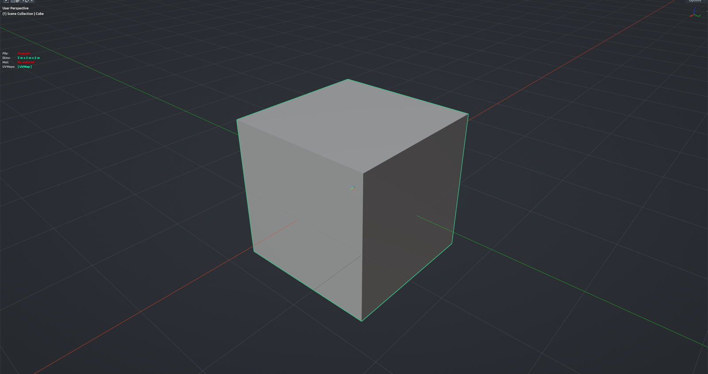

# Cursor Rotate

Turns the 3D cursor around its own X, Y or Z axis by a fixed angle (90° by default). The rotation is relative to the cursor's current orientation, so repeated presses keep stepping it round. Handy for setting up a cursor-based transform orientation or pivot without leaving the viewport. Works in any mode.

**Hotkey:** Not bound by default — assign a key in *Preferences › iOps › Keymaps*, or run it from the iOps pie / operator search.

## Options

- **Axis** — X, Y or Z of the cursor.
- **Angle** — step in degrees.
- **Reverse** — rotate the other way.
