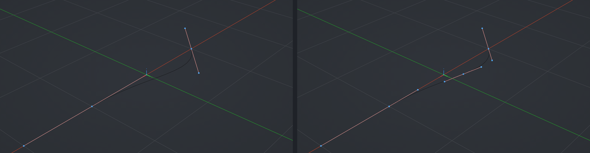

# Curve Subdivide

Subdivide the selected bezier segments with a live preview. Scroll the wheel to set the number of cuts, watch the new points appear along the curve, click to commit. Edit Curve mode.

**Hotkey:** Not bound by default — assign a key in *Preferences › iOps › Keymaps*. Also available: Edit Pie › *Subdivide* (curve in Edit Mode, <kbd>F2</kbd> slot).

## Controls
| Key | Action |
| --- | --- |
| Wheel up / down | More / fewer cuts |
| <kbd>MMB</kbd> | Navigate the viewport |
| <kbd>LMB</kbd> / <kbd>Space</kbd> | Confirm |
| <kbd>Esc</kbd> / <kbd>RMB</kbd> | Cancel |
| <kbd>H</kbd> | Show / hide the help legend |

## Tips
- Select at least two neighbouring control points; only connected selected segments are cut.
- The number of cuts can still be changed in the redo panel afterwards.
