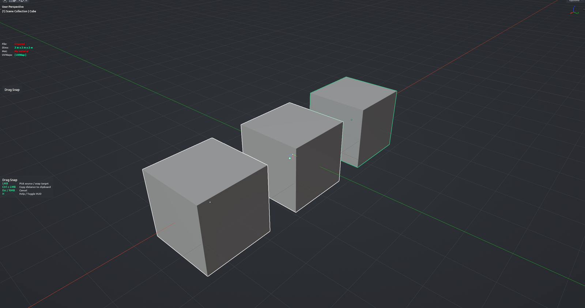

# Drag Snap

Vertex-to-vertex move for objects, without entering Edit Mode. Hover a mesh, click the vertex you want to move from, then click the vertex you want to land on — the whole selection is moved by that offset. Use it to butt kit pieces together precisely in Object Mode.

**Hotkey:** <kbd>Ctrl</kbd>+<kbd>Alt</kbd>+<kbd>Shift</kbd>+<kbd>S</kbd> (Object Mode, 3D View)

## Controls
| Key | Action |
| --- | --- |
| Mouse move | Highlight the nearest vertex under the cursor |
| <kbd>LMB</kbd> (first click) | Pick the source vertex |
| <kbd>LMB</kbd> (second click) | Pick the target vertex and move the selection |
| <kbd>Ctrl</kbd>+<kbd>LMB</kbd> | Copy the source-to-target distance to the clipboard instead of moving |
| <kbd>MMB</kbd> / Wheel | Navigate the viewport |
| <kbd>Esc</kbd> / <kbd>RMB</kbd> | Cancel |
| <kbd>H</kbd> | Show / hide the help legend |

## Tips
- Click the same vertex twice to place the 3D cursor there instead of moving anything.
- Only mesh vertices are snap targets; edges, faces and non-mesh objects are ignored.
