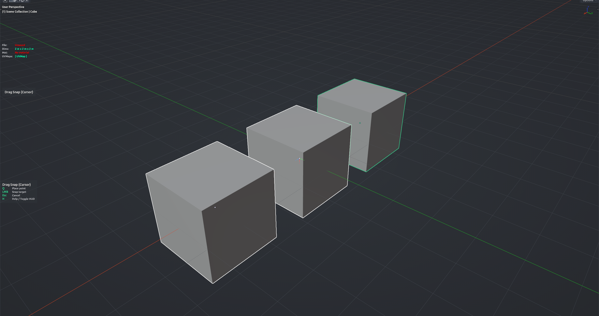

# Drag Snap Cursor

Point-to-point move driven by the 3D Cursor. Press <kbd>Q</kbd> and drag the cursor onto a source vertex, press <kbd>Q</kbd> again to lock it, then <kbd>Q</kbd>-drag onto the target vertex — the selected objects are moved by the resulting offset. Handy for exact alignment between two objects in Object Mode.

**Hotkey:** Not bound by default — assign a key in *Preferences › iOps › Keymaps*, or run it from operator search.

## Controls
| Key | Action |
| --- | --- |
| <kbd>Q</kbd> (hold + drag) | Snap the 3D Cursor to the vertex under the mouse; release to place the point |
| <kbd>Q</kbd> (press) | Confirm the current point and move on to the next step |
| <kbd>MMB</kbd> / Wheel | Navigate the viewport |
| <kbd>Esc</kbd> / <kbd>RMB</kbd> | Cancel |
| <kbd>H</kbd> | Show / hide the help legend |

## Tips
- The status bar tells you which step you are on (point A, confirm, point B).
- Cancelling after the first point leaves the 3D Cursor where you snapped it.
