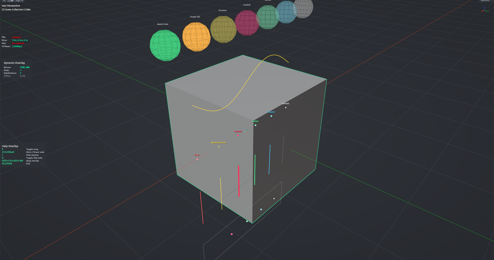

# Theme Preview

Shows a live sample of every iOps overlay element in the 3D Viewport — points, lines, handles, ghost meshes, a sample HUD and a sample help legend — so you can tune colours, sizes and line widths in the Theme tab and see the result immediately. The sample is drawn at the 3D cursor.

**Hotkey:** Not bound by default — click **Preview** in *Preferences › iOps › Theme* (the button turns into **Stop**). A 3D Viewport must be open.

## Controls

| Key | Action |
| --- | --- |
| <kbd>Esc</kbd> / <kbd>RMB</kbd> | Exit the preview |
| <kbd>S</kbd> | Toggle the sample "Snap" state |
| <kbd>Ctrl</kbd>+<kbd>Wheel</kbd> or <kbd>Ctrl</kbd>+<kbd>+</kbd> / <kbd>-</kbd> | Change the sample "Subdivisions" value |
| <kbd>H</kbd> | Show / hide the help legend |
| <kbd>/</kbd> | Hide / show HUD parameters |
| <kbd>Shift</kbd>+<kbd>Ctrl</kbd>+<kbd>Alt</kbd>+<kbd>LMB</kbd> drag | Move the HUD or help overlay |

## Tips

- Plain mouse wheel still zooms the viewport while the preview runs.
- Edit a colour in the Theme tab and watch the viewport — changes apply on the next frame.
