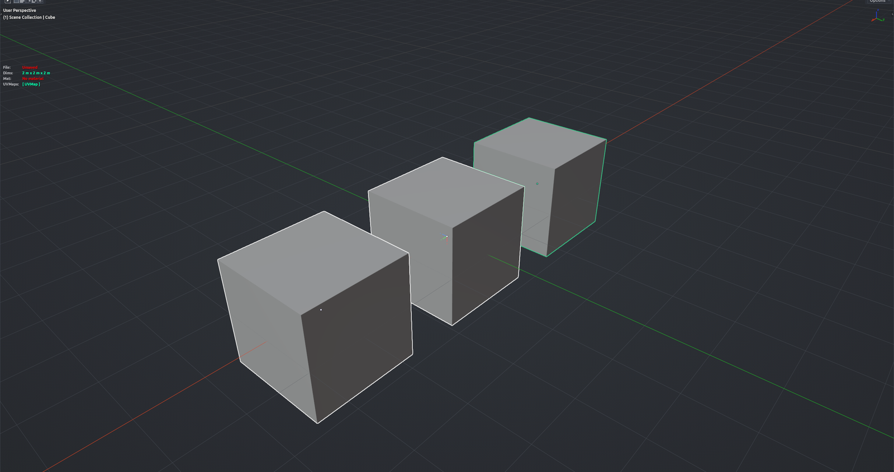

# Easy Mod — Shwarp

Adds a ready-made Shrinkwrap modifier to every selected mesh, targeting the active object. Select the meshes to conform, make the target active, run. Optionally also adds a Data Transfer modifier that copies the target's custom normals. Object Mode.

**Hotkey:** Not bound by default — run it from the iOps Pie › *Easy Modifier - SHWARP*, or from operator search.

## Options
- **Offset** — distance to keep from the target surface.
- **Mode** — Nearest Surface Point, Project, Nearest Vertex or Target Project. Project also enables Z-axis projection in both directions.
- **Use vertex groups** — mask the modifier with the object's first vertex group.
- **Transfer Normals** — add a Data Transfer modifier for custom normals from the target.
- **Mod location in stack** — First, Last, Before Active or After Active.

## Tips
- Objects that already have an iOps Shwarp modifier are skipped.
- The modifier is shown in Edit Mode and on the cage, so edits stay glued to the target.
