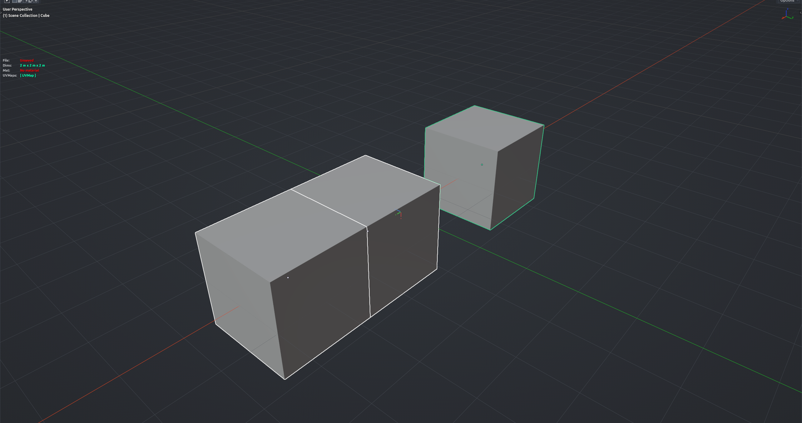

# Grid from Active

Snaps every selected object onto a grid built from the active object: the active object's location is the grid origin and its bounding-box size is the cell size. Use it in Object Mode to line up modular kit pieces that are not 1 m cubes.

**Hotkey:** Not bound by default — assign a key in *Preferences › iOps › Keymaps*, or run it from operator search.

## Tips
- Select the pieces to align, then make the reference piece active.
- The active object needs a real size on every axis you care about — a flat plane gives a degenerate grid on its thin axis.
- Rotation and non-uniform scale on the active object skew the grid; apply them first.
