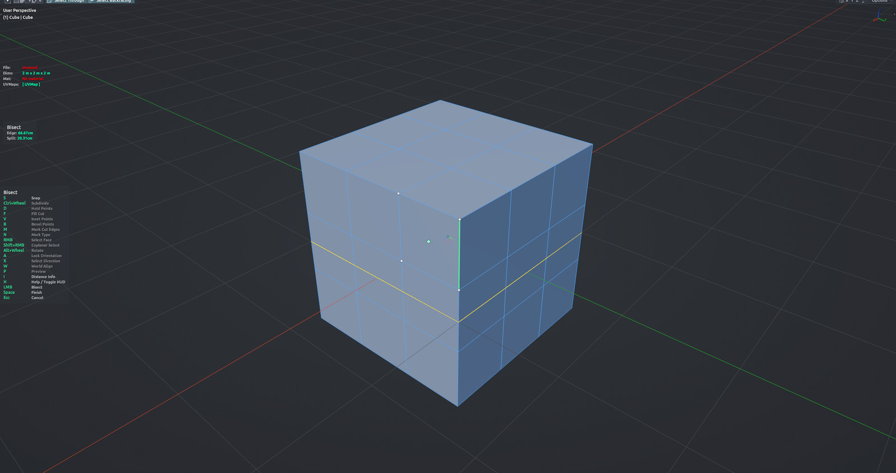

# Cursor Bisect

Cuts the mesh with a plane anchored to the 3D cursor and aligned to the face and edge under the mouse. Snap the cut to vertices, edge midpoints, regular subdivisions or a typed distance from an edge end, then click to cut — stay in the tool and keep cutting. Bevel mode drops two parallel cuts at once, Fill mode cuts at every snap point along the highlighted edge, and new edges can be marked as seam / sharp / crease / bevel weight. Edit Mesh mode.

**Hotkey:** Not bound by default — assign a key in *Preferences › iOps › Keymaps*, or run it from the iOps pie / operator search.

## Controls
| Key | Action |
| --- | --- |
| Move mouse | Pick the face and edge under the cursor, place the cut |
| <kbd>LMB</kbd> | Cut (stays in the tool) |
| <kbd>RMB</kbd> | Select / deselect the face under the cursor (only selected faces get cut) |
| <kbd>Shift</kbd>+<kbd>RMB</kbd> | Add / remove coplanar faces around the clicked face |
| <kbd>Ctrl</kbd>+<kbd>Wheel</kbd> | More / fewer snap subdivisions on the edge |
| <kbd>Alt</kbd>+<kbd>Wheel</kbd> | Rotate the cut plane in steps |
| <kbd>S</kbd> | Snapping on / off |
| <kbd>D</kbd> | Hold the current snap points |
| <kbd>A</kbd> | Lock the current orientation |
| <kbd>X</kbd> | Swap which cursor axis is the cut normal |
| <kbd>W</kbd> | Cycle world-axis alignment (X → Y → Z) |
| <kbd>P</kbd> | Preview as a line or as a plane |
| <kbd>F</kbd> | Fill cut: cut at every snap point on the highlighted edge |
| <kbd>V</kbd> | Inset points: extra snap points at a fixed distance from the edge ends |
| <kbd>B</kbd> | Bevel mode: two parallel cuts |
| <kbd>0</kbd>–<kbd>9</kbd>, <kbd>.</kbd>, <kbd>Backspace</kbd>, <kbd>Enter</kbd> | Type the inset / bevel distance (while V or B is on) |
| <kbd>M</kbd> | Mark the new cut edges |
| <kbd>N</kbd> | Cycle mark type: Seam → Sharp → Crease → Bevel |
| <kbd>I</kbd> | Show distance info near the cursor |
| <kbd>Z</kbd> | Deselect all |
| <kbd>Ctrl</kbd>+<kbd>Z</kbd> | Undo the last cut |
| <kbd>MMB</kbd> / <kbd>Wheel</kbd> | Navigate the viewport |
| <kbd>H</kbd> | Show / hide the help legend |
| <kbd>Space</kbd> | Finish |
| <kbd>Esc</kbd> | Cancel |

## Options
- **Merge Doubles** — merge vertices left close together after the cut, using the merge distance from the preferences.

## Tips
- Deforming modifiers (Subdivision, Solidify, Array…) are switched off while the tool runs so you cut the base mesh; they come back on exit.
- Your snap / mark / preview settings are remembered for the next run.
