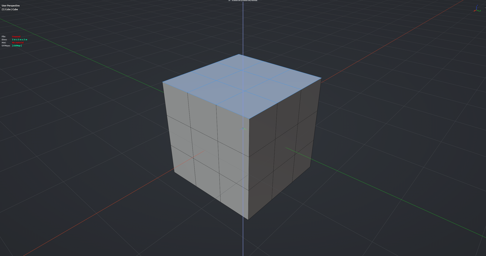

# Extrude (Keep Edge Data)

Extrudes like Blender's E, but carries sharp, bevel weight and crease from the original edges onto the new side edges, so hard edges stay hard after you extend a shape. It also continues marks from neighbouring marked edges that the new side edges line up with. Faces extrude along the normal; edges and vertices extrude freely. Edit Mesh mode.

Three flavours are added to the <kbd>Alt</kbd>+<kbd>E</kbd> extrude menu: **Extrude (Keep Edge Data)**, **Extrude Along Normals (Keep Edge Data)** and **Extrude Individual Faces (Keep Edge Data)**.

**Hotkey:** Not bound by default — assign a key in *Preferences › iOps › Keymaps*, or run it from the iOps pie / operator search. A good place for it is the native <kbd>E</kbd>.

## Controls
| Key | Action |
| --- | --- |
| Move mouse | Set the extrude distance |
| <kbd>X</kbd> / <kbd>Y</kbd> / <kbd>Z</kbd> | Constrain the axis (as in native transform) |
| <kbd>LMB</kbd> / <kbd>Enter</kbd> | Confirm |
| <kbd>Esc</kbd> / <kbd>RMB</kbd> | Cancel the move (new geometry stays at zero offset, as with native extrude) |

## Options
- **From Selection** — copy marks from the extruded edges onto the new side edges.
- **Clear Selected** — remove the marks from the original edges, which usually become interior after extending a shape.
- **Continue Parents** — continue marks from pre-existing marked edges the new side edges line up with.
- **Continuation Angle** — how far off a straight line an edge may be and still count as a continuation (default 45°).

## Tips
- Seams and Freestyle marks are never propagated.
- Bevel weight and crease only flow through layers the mesh already has; none are created.
