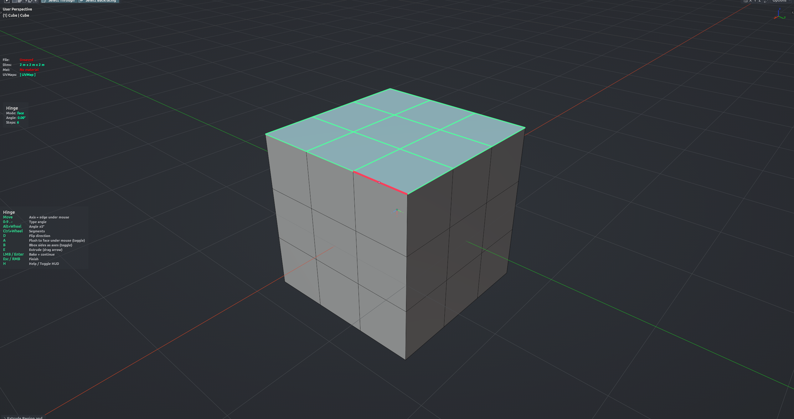

# Hinge

Rotates the selected faces (or edges) around the edge under the mouse, baking the sweep as segments — like folding a flap on a hinge. Type the angle, set segments with Ctrl+Wheel, or press A to land the selection flush on a face you point at. Each confirm bakes and lets you keep going from the new position. Edit Mesh mode.

**Hotkey:** Not bound by default — assign a key in *Preferences › iOps › Keymaps*, or run it from the iOps pie / operator search. Also available: iOps Pie › Hinge.

## Controls
| Key | Action |
| --- | --- |
| Move mouse | Hinge axis = edge under the cursor |
| <kbd>0</kbd>–<kbd>9</kbd>, <kbd>.</kbd>, <kbd>-</kbd>, <kbd>Backspace</kbd> | Type the angle |
| <kbd>Alt</kbd>+<kbd>Wheel</kbd> | Angle ±5° |
| <kbd>Ctrl</kbd>+<kbd>Wheel</kbd> | Segments |
| <kbd>D</kbd> | Flip direction |
| <kbd>A</kbd> | Flush: rotate until coplanar with the face under the cursor (toggle) |
| <kbd>B</kbd> | Use the selection's bounding-box sides as axes (toggle) |
| <kbd>E</kbd> | Extrude the selection (drag the arrow), then continue hinging |
| <kbd>MMB</kbd> / <kbd>Wheel</kbd> | Navigate the viewport |
| <kbd>H</kbd> | Show / hide the help legend |
| <kbd>LMB</kbd> / <kbd>Enter</kbd> | Bake and continue |
| <kbd>Esc</kbd> / <kbd>RMB</kbd> | Finish (the first press only leaves Flush mode if it is on) |

## Tips
- The preview is a ghost; the mesh only changes when you bake.
