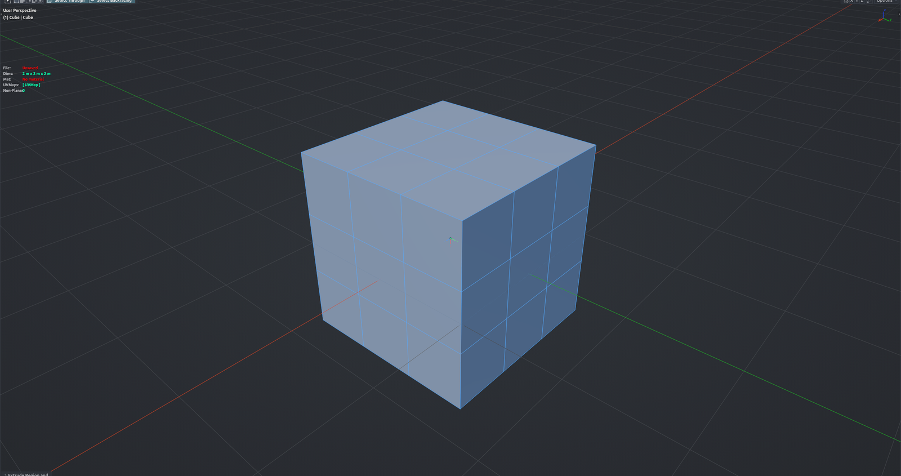

# Non-Planar Faces Overlay

Toggles a live overlay that tints every non-planar face of the mesh you are editing. The stronger the warp, the stronger the tint; flatten a face and its highlight disappears. A **Non-Planar** count appears in the iOps statistics overlay (red while faces need fixing, green at zero). The overlay sticks across object and mode switches until you toggle it off. Edit Mesh mode.

**Hotkey:** Not bound by default — assign a key in *Preferences › iOps › Keymaps*, or run it from the iOps pie / operator search. Also available: iOps Edit Pie › Non-Planar Overlay, iOps Pie › Non-Planar Overlay.

## Options
- **Non-Planar Angle** (Preferences › iOps › Non-Planar Overlay) — faces bent less than this count as planar (default 0.5°).

## Tips
- Only the active object is checked; hidden faces and triangles are ignored.
