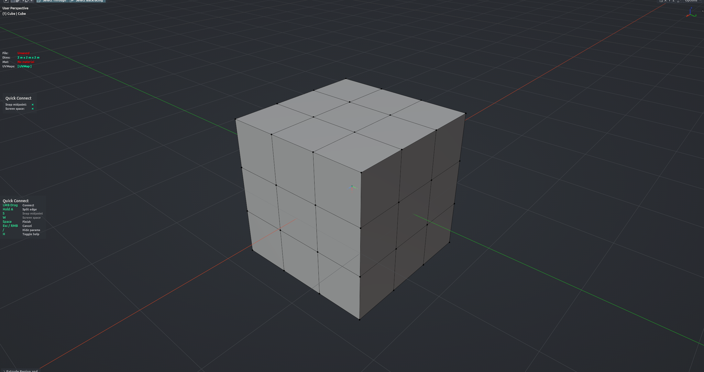

# Quick Connect

Cuts an edge between two vertices in one drag: press on the first vertex, drag to the second, release. The tool stays active so you can keep connecting, and Esc rolls back everything from the session. Hold A over a face to split one of its edges and connect to the new vertex. Edit Mesh mode.

**Hotkey:** Not bound by default — assign a key in *Preferences › iOps › Keymaps*, or run it from the iOps pie / operator search. Also available: iOps Pie › Quick Connect.

## Controls
| Key | Action |
| --- | --- |
| <kbd>LMB</kbd> drag | Connect the start vertex to the vertex under the cursor on release |
| Hold <kbd>A</kbd> | Preview a split on the hovered edge; release to split and connect |
| <kbd>S</kbd> | Snap the split point to the edge midpoint |
| <kbd>W</kbd> | Screen-space vertex picking (ignores vertices hidden behind faces) |
| <kbd>MMB</kbd> / <kbd>Wheel</kbd> | Navigate the viewport |
| <kbd>H</kbd> | Show / hide the help legend |
| <kbd>Space</kbd> | Finish, keep changes |
| <kbd>Esc</kbd> / <kbd>RMB</kbd> | Cancel and undo all connects from this session |
