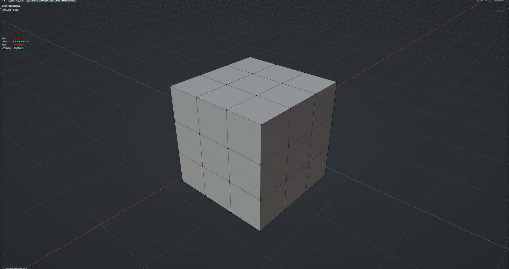

# Quick Snap

Snaps the selected vertices of every mesh in Edit Mode onto the nearest surface or vertex of other visible meshes in one click — no transform snapping setup needed. Use it to seat geometry on a reference model or close gaps between parts. Edit Mesh mode.

**Hotkey:** Not bound by default — assign a key in *Preferences › iOps › Keymaps*, or run it from the iOps pie / operator search. Also available: iOps Pie › Quick Snap.

## Options
- **Surface** — snap to the closest point on the surface instead of the closest vertex.
- **Self** — also allow snapping onto the same object's unselected geometry.
- **Normal Check / Angle** — ignore targets whose surface faces away from the vertex.

## Tips
- Target meshes with modifiers are skipped; apply them first if you need to snap to them.
