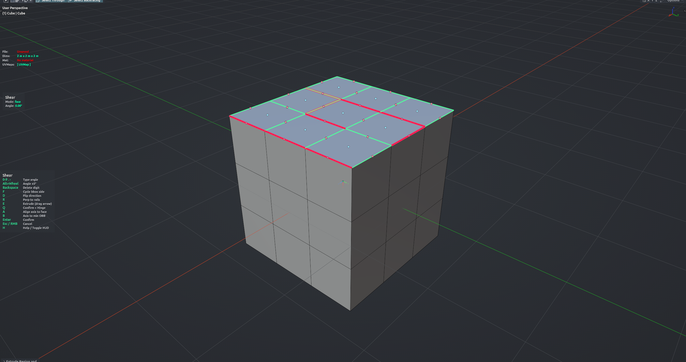

# Shear (Smart)

Tilts a selected face (or edge) by a typed angle while its corners stay glued to the surrounding mesh — each vertex slides along its own connected edge instead of floating off. Great for "saw-off" cuts on chamfered blocks. Pick the pivot side on the on-screen widget, then extrude the sheared face along mirrored rails or hinge it around an edge without leaving the tool. Edit Mesh mode; faces take priority over edges.

**Hotkey:** Not bound by default — assign a key in *Preferences › iOps › Keymaps*, or run it from the iOps pie / operator search. Also available: iOps Pie › Shear.

## Controls
| Key | Action |
| --- | --- |
| <kbd>0</kbd>–<kbd>9</kbd>, <kbd>.</kbd>, <kbd>-</kbd>, <kbd>Backspace</kbd> | Type the angle |
| <kbd>LMB</kbd> on a handle | Set the pivot side (face) or the fixed vertex (edge); the centre dot resets |
| <kbd>F</kbd> | Face: switch the tilt axis. Edge: flip the moving vertex |
| <kbd>D</kbd> | Flip direction / sign |
| <kbd>R</kbd> | Reset perpendicular to the rails |
| <kbd>A</kbd> | Align the axis to the face under the cursor |
| <kbd>B</kbd> | Align the axis to the long side of the face |
| <kbd>E</kbd> | Extrude the sheared face along mirrored rails (drag, then confirm) |
| <kbd>Q</kbd> | Hinge the selection around the pivot edge (see below) |
| <kbd>MMB</kbd> / <kbd>Wheel</kbd> | Navigate the viewport |
| <kbd>H</kbd> | Show / hide the help legend |
| <kbd>Enter</kbd> / <kbd>Space</kbd> | Confirm |
| <kbd>Esc</kbd> / <kbd>RMB</kbd> | Cancel |

Extrude (after <kbd>E</kbd>): move the mouse to set the distance, <kbd>Shift</kbd> for precision, <kbd>LMB</kbd> / <kbd>Enter</kbd> to confirm and return to shear, <kbd>Esc</kbd> / <kbd>RMB</kbd> to drop the extrusion.

Hinge (after <kbd>Q</kbd>): type the angle, <kbd>Ctrl</kbd>+<kbd>Wheel</kbd> for segments, <kbd>D</kbd> to flip, <kbd>A</kbd> to land flush on the face under the cursor, <kbd>Enter</kbd> / <kbd>Space</kbd> to bake and return to shear, <kbd>Esc</kbd> / <kbd>RMB</kbd> to go back.

## Tips
- The typed angle is the real resulting tilt, also on slanted chamfer rails.
- The last selected edge or vertex seeds the axis / moving endpoint.
