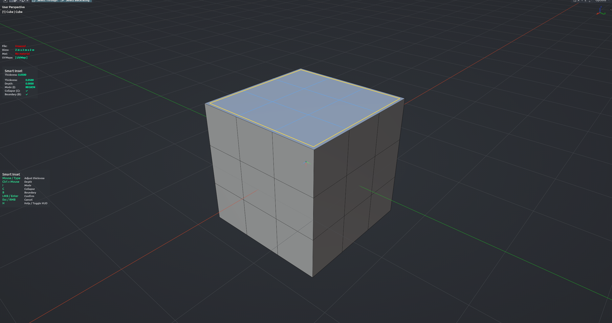

# Smart Inset

Insets the selected faces without the flipped or overlapping geometry the regular inset produces when pushed too far. Every boundary edge moves inward at the same speed; where opposite sides meet, the region cleanly collapses into a ridge or a point instead of self-intersecting. Drag for thickness, hold Ctrl for depth, or type exact values. Edit Mesh mode.

**Hotkey:** Not bound by default — assign a key in *Preferences › iOps › Keymaps*, or run it from the iOps pie / operator search. Also available: iOps Pie › Smart Inset.

## Controls
| Key | Action |
| --- | --- |
| Move mouse | Set thickness |
| <kbd>Shift</kbd> | Precise (slow) adjustment |
| <kbd>Ctrl</kbd> + move | Set depth instead of thickness |
| <kbd>0</kbd>–<kbd>9</kbd>, <kbd>.</kbd>, <kbd>-</kbd>, <kbd>Backspace</kbd> | Type an exact thickness |
| <kbd>I</kbd> | Region / Individual faces |
| <kbd>C</kbd> | Allow collapse on / off |
| <kbd>B</kbd> | Inset from open borders on / off |
| <kbd>MMB</kbd> / <kbd>Wheel</kbd> | Navigate the viewport |
| <kbd>H</kbd> | Show / hide the help legend |
| <kbd>LMB</kbd> / <kbd>Enter</kbd> | Confirm |
| <kbd>Esc</kbd> / <kbd>RMB</kbd> | Cancel |

## Options
- **Thickness** — inward offset; negative values outset.
- **Depth** — push the new inner faces along the normal.
- **Mode** — one inset per connected group of faces (Region) or one per face (Individual).
- **Allow Collapse** — let the inset run past the point where sides meet. Off keeps it clamped like a normal inset; the preview turns to the warning colour when clamped.
- **Boundary** — also inset from open mesh borders.

## Tips
- Interior faces the inset has not reached yet are kept as they are.
- The new inner faces stay selected so you can chain another operation right away.
- Selections that wrap around more than half a turn (most of a cylinder) are skipped with a warning.
