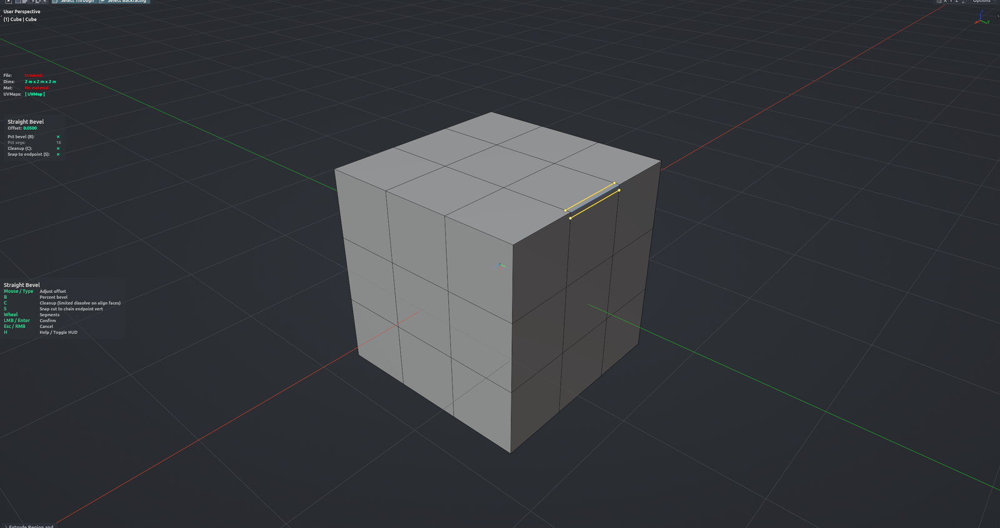

# Straight Bevel

Bevels selected edges with perfectly straight, perpendicular cuts across the neighbouring faces — for corner ridges where the regular bevel bows the new edge or drifts off a true offset. From the same session you can switch to a rounded Percent bevel, or a Flat Fan that keeps the corner coplanar with a cap face you pick. Drag or type the offset. Edit Mesh mode.

**Hotkey:** Not bound by default — assign a key in *Preferences › iOps › Keymaps*, or run it from the iOps pie / operator search. Also available: iOps Pie › Straight Bevel.

## Controls
| Key | Action |
| --- | --- |
| Move mouse | Set the offset |
| <kbd>Shift</kbd> + drag | Precise (slow) adjustment |
| <kbd>Ctrl</kbd> + drag | Snap the offset to 0.1 steps |
| <kbd>0</kbd>–<kbd>9</kbd>, <kbd>.</kbd>, <kbd>Backspace</kbd> | Type an exact offset |
| <kbd>B</kbd> | Percent (rounded) bevel preview |
| <kbd>F</kbd> | Flat Fan preview |
| <kbd>Q</kbd> | Flat Fan: pick the alignment face under the cursor |
| <kbd>W</kbd> | Flat Fan: project / recompute the boundary |
| <kbd>Wheel</kbd> | Segments (Percent / Flat Fan only) |
| <kbd>C</kbd> | Clean up coplanar leftovers after the bevel |
| <kbd>S</kbd> | Snap cut endpoints to the chain end vertex |
| <kbd>MMB</kbd> | Navigate the viewport |
| <kbd>H</kbd> | Show / hide the help legend |
| <kbd>LMB</kbd> / <kbd>Enter</kbd> / <kbd>Space</kbd> | Confirm |
| <kbd>Esc</kbd> / <kbd>RMB</kbd> | Cancel |

## Options
- **Offset** — perpendicular distance from the ridge to the new cut.
- **Mode** — Straight, Percent or Flat Fan.
- **Segments** — for Percent and Flat Fan modes (1–16).
- **Align Mode** — Flat Fan boundary: project onto the picked face, or resample evenly in its plane.
- **Cleanup** — dissolve geometry left coplanar with the alignment faces.
- **Snap to Endpoint** — weld the cut end into the chain end vertex.

## Tips
- The offset is capped so no cut can run past the end of its neighbouring edge.
- A face picked with <kbd>Q</kbd> is not remembered by the redo panel; redo uses the best automatic candidate.
