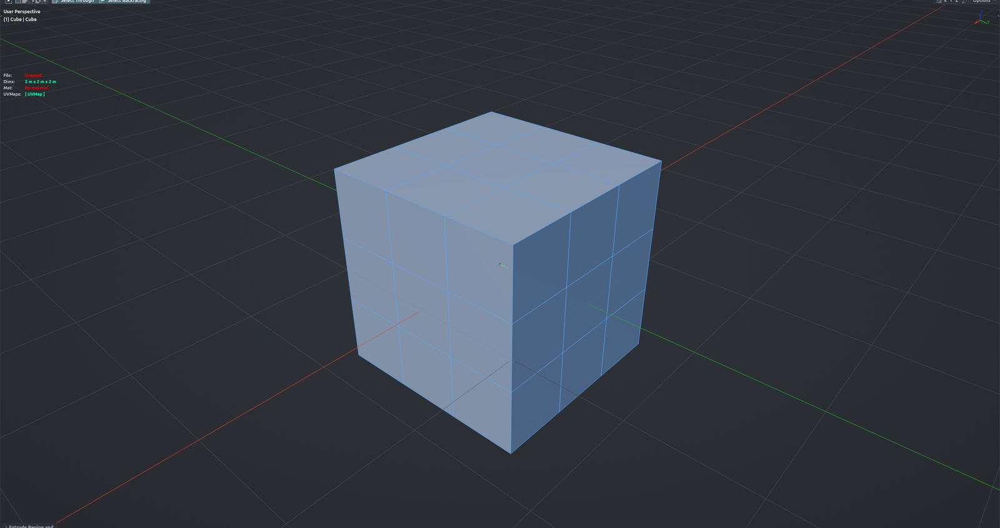

# Mesh to Grid

Snaps every vertex of the active mesh to the nearest grid step on X, Y and Z. Use it in Edit Mesh mode to clean up coordinates that drifted off round values after sculpting, importing or stacked transforms. The whole mesh is processed; selection is ignored.

**Hotkey:** <kbd>Up Arrow</kbd> (Edit Mesh)

## Options
- **Base** — grid step in scene units (default 0.01). Change it in the redo panel (F9) to re-snap at a different step.

## Tips
- This is the tool's own step, not Blender's viewport grid overlay.
- Only the active object is touched, even in multi-object edit.
