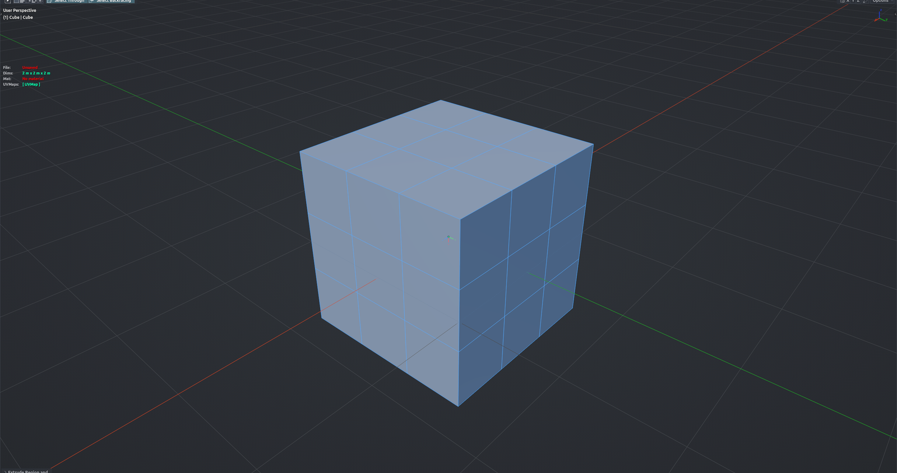

# Tris to Quads

Triangulates the selected faces and immediately merges them back into quads, all in one undo step with one redo panel. Use it to re-flow imported or boolean-heavy geometry with consistent diagonals while respecting seams, sharp edges, UVs and materials. Edit Mesh mode.

**Hotkey:** Not bound by default — assign a key in *Preferences › iOps › Keymaps*, or run it from the iOps pie / operator search. Also available: iOps Pie › Tris to Quads.

## Options
- **Quad Method / N-gon Method** — how faces are split into triangles first.
- **Max Face Angle / Max Shape Angle** — how far from flat and square a pair of triangles may be and still merge.
- **Topology Influence** — how much existing edge flow steers the merge.
- **Compare UVs / Colors / Seams / Sharp / Materials** — do not merge across these boundaries.
- **Deselect Joined** — deselect faces that got merged.

## Tips
- Quads in the selection are split and re-merged too, so their diagonals may change.
