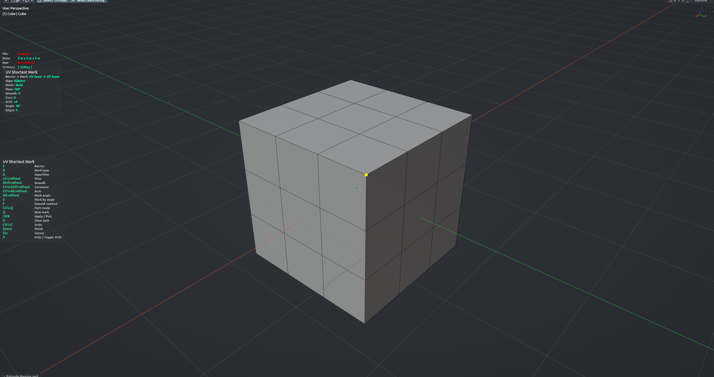

# UV Shortest Mark

Marks seams, sharp edges, crease or bevel weight along the shortest path across the mesh, stopping at barrier edges you already marked. In **Build** mode click a start vertex and then a target to lay down a chain; in **Direction** mode hover an edge and the path runs forward until it hits a barrier. Tune the route with flow, smoothing, curvature and arch, or re-route all existing marks through smoother edges. Edit Mesh mode.

**Hotkey:** Not bound by default — assign a key in *Preferences › iOps › Keymaps*, or run it from the iOps pie / operator search.

## Controls
| Key | Action |
| --- | --- |
| Move mouse | Preview the path |
| <kbd>LMB</kbd> | Build: set the anchor, then apply and chain onward. Direction: apply the previewed path |
| <kbd>Q</kbd> | Start a new chain |
| <kbd>Ctrl</kbd>+<kbd>Q</kbd> | Switch Build ↔ Direction |
| <kbd>E</kbd> | Cycle barrier type: Seam → Sharp → Crease → Bevel Weight |
| <kbd>R</kbd> | Cycle mark type |
| <kbd>A</kbd> | Cycle path algorithm (Dijkstra → A* → Edge Loop) |
| <kbd>S</kbd> | Mark / unmark all edges sharper than the angle threshold |
| <kbd>D</kbd> | Clear marks along the previewed path |
| <kbd>F</kbd> | Smooth Marked: re-route existing marks (see below) |
| <kbd>Ctrl</kbd>+<kbd>Wheel</kbd> | Flow angle |
| <kbd>Shift</kbd>+<kbd>Wheel</kbd> | Smooth level |
| <kbd>Alt</kbd>+<kbd>Wheel</kbd> | Sharp angle threshold |
| <kbd>Ctrl</kbd>+<kbd>Shift</kbd>+<kbd>Wheel</kbd> | Curvature bias (convex ↔ concave) |
| <kbd>Ctrl</kbd>+<kbd>Alt</kbd>+<kbd>Wheel</kbd> | Arch strength (Build mode) |
| <kbd>Ctrl</kbd>+<kbd>Z</kbd> | Undo the last mark |
| <kbd>MMB</kbd> / <kbd>Wheel</kbd> | Navigate the viewport |
| <kbd>H</kbd> | Show / hide the help legend |
| <kbd>Space</kbd> / <kbd>Enter</kbd> | Finish |
| <kbd>Esc</kbd> | Cancel |

Smooth Marked (after <kbd>F</kbd>): <kbd>Alt</kbd>+<kbd>Wheel</kbd> magnet, <kbd>Shift</kbd>+<kbd>Wheel</kbd> iterations, <kbd>Space</kbd> / <kbd>Enter</kbd> accept the proposed route, <kbd>F</kbd> / <kbd>Esc</kbd> back without changes.

## Tips
- Your barrier, mark, algorithm and tuning settings are remembered for the next run.
- A Triangulate modifier is hidden while the tool runs so you pick on the real geometry.
