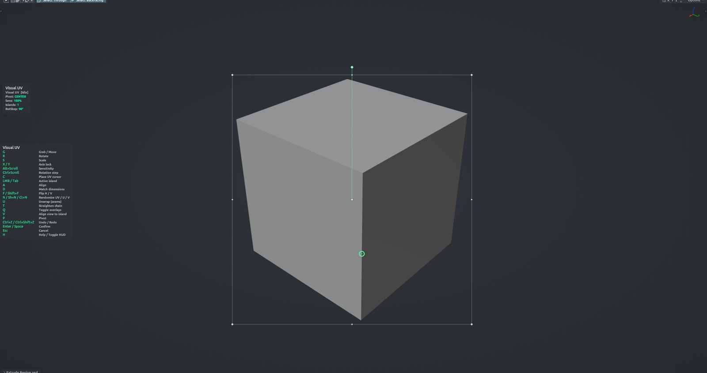

# Visual UV

Edit UV islands directly on the model in the 3D Viewport. Islands on the selected faces are colour-coded and the active one shows a bounding box with handles, a pivot and a rotation knob; grab, rotate, scale, flip, align, randomise or unwrap them without opening the UV Editor. Edit Mesh mode with faces selected.

**Hotkey:** <kbd>Ctrl</kbd>+<kbd>Alt</kbd>+<kbd>U</kbd> (Edit Mesh). Also available: iOps Edit Pie › Visual UV.

## Controls
| Key | Action |
| --- | --- |
| <kbd>LMB</kbd> on an island | Make it the active island |
| <kbd>LMB</kbd> on a handle / knob | Scale / rotate by dragging the handle |
| <kbd>Tab</kbd> | Cycle the active island |
| <kbd>G</kbd> / <kbd>R</kbd> / <kbd>S</kbd> | Grab / Rotate / Scale around the pivot (hover a handle to use it as the pivot) |
| <kbd>X</kbd> / <kbd>Y</kbd> | Lock an axis while transforming |
| <kbd>Shift</kbd> | Constrain to the dominant axis (grab) / uniform scale |
| <kbd>Ctrl</kbd> | Snap: 1/16 UV steps, rotation step, 0.05 scale |
| <kbd>Ctrl</kbd>+<kbd>Wheel</kbd> | Change the rotation snap step (1…90°) |
| <kbd>Alt</kbd>+<kbd>Wheel</kbd> | Mouse sensitivity |
| <kbd>C</kbd> / <kbd>P</kbd> | Place the UV cursor / toggle pivot Center ↔ Cursor |
| <kbd>A</kbd> | Align selected islands to the active one's hovered handle, or pick an edge to align to |
| <kbd>F</kbd> / <kbd>Shift</kbd>+<kbd>F</kbd> | Flip horizontal / vertical |
| <kbd>D</kbd> | Match the size of selected islands to the active one |
| <kbd>N</kbd> / <kbd>Shift</kbd>+<kbd>N</kbd> / <kbd>Ctrl</kbd>+<kbd>N</kbd> | Randomise offset: both axes / U only / V only |
| <kbd>U</kbd> | Unwrap the selection |
| <kbd>T</kbd> | Straighten the UV edge chain under the cursor |
| <kbd>Q</kbd> | Clean view: hide overlays |
| <kbd>Ctrl</kbd>+<kbd>Z</kbd> / <kbd>Ctrl</kbd>+<kbd>Shift</kbd>+<kbd>Z</kbd> | Undo / redo inside the session |
| <kbd>RMB</kbd> | Cancel the current transform |
| <kbd>MMB</kbd> / <kbd>Wheel</kbd> | Navigate the viewport |
| <kbd>H</kbd> | Show / hide the help legend |
| <kbd>Enter</kbd> / <kbd>Space</kbd> | Confirm |
| <kbd>Esc</kbd> | Cancel and restore the original UVs |

## Options
- **Tile Limit** — how many tiles an island may drift from 0–1 before it is re-centred.
- **Rotation Step** — snap step for Ctrl-rotate.
- **Grab Sensitivity** — mouse-to-UV multiplier.

## Tips
- Each island shows its texel density next to its centre.
