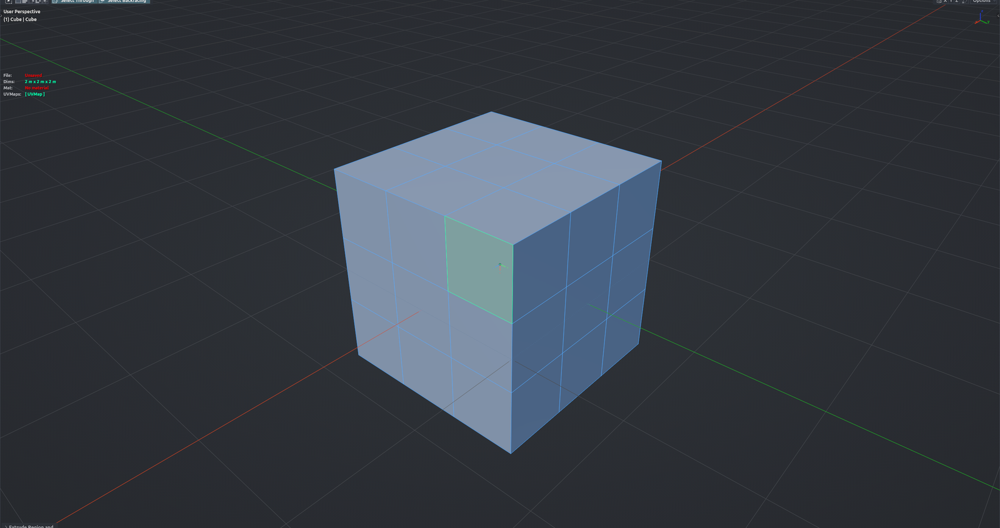

# Mouseover Fill Select

Hover over a face and press the key: the face under the mouse and every face connected to it across smooth (non-sharp) edges gets added to the selection. A fast way to grab a whole flat patch or a panel without clicking a seed face first. Edit Mesh mode.

**Hotkey:** Not bound by default — assign a key in *Preferences › iOps › Keymaps*, or run it from the iOps pie / operator search.

## Tips
- It always adds to the current selection; deselect first if you want only the new island.
- The spread stops at hard edges and split-normal boundaries.
