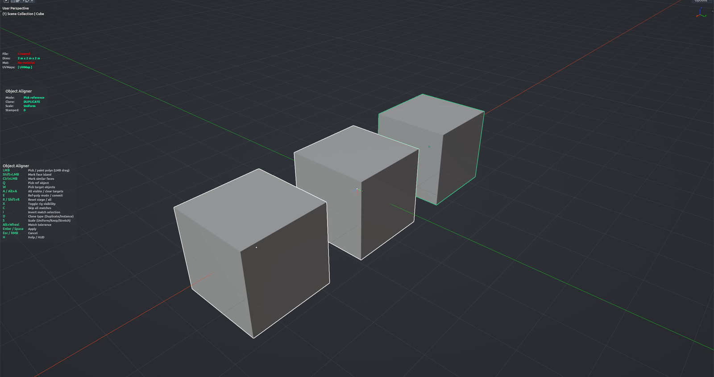

# Object Aligner

Takes an assembly you have placed correctly on one object and stamps copies onto other objects with the same relative placement. Pick the reference object, click the targets, confirm. For repeated details, mark a face pattern on the reference and the tool finds every matching (and mirrored) copy of that pattern across the targets for you. Nothing is created until you confirm — pending placements are shown as ghosts. Object Mode.

**Hotkey:** Not bound by default — assign a key in *Preferences › iOps › Keymaps*, or run it from the iOps pie / operator search. Also available: iOps Pie (<kbd>Ctrl</kbd>+<kbd>Alt</kbd>+<kbd>Shift</kbd>+<kbd>Q</kbd>) › Object Aligner, and as a custom slot in the Edit pie.

## Controls

| Key | Action |
| --- | --- |
| <kbd>LMB</kbd> | Pick the reference / toggle a target / toggle a face, depending on the step |
| <kbd>Q</kbd> | Pick reference object |
| <kbd>W</kbd> | Pick target objects |
| <kbd>E</kbd> | Mark reference faces; press again to search targets for matching patterns |
| <kbd>C</kbd> | Clear all found pattern matches |
| <kbd>I</kbd> | Invert kept pattern matches |
| <kbd>R</kbd> | Reset everything and start over |
| <kbd>D</kbd> | Clone mode: Duplicate / Instance |
| <kbd>S</kbd> | Scale mode: Uniform / Keep / Stretch |
| <kbd>X</kbd> | Hide / show the source objects while working |
| <kbd>H</kbd> | Show / hide the help legend |
| <kbd>Enter</kbd> / <kbd>Space</kbd> / <kbd>RMB</kbd> | Confirm and create the copies |
| <kbd>Esc</kbd> | Cancel |

## Tips

- Select the objects to stamp first; they are ignored by picking so you can click through them.
- Whole-object flow: <kbd>Q</kbd> click reference, click targets, <kbd>Enter</kbd>. Pattern flow: pick reference and targets, <kbd>E</kbd>, click faces, <kbd>E</kbd> again, then click matches to keep or skip.
- Picking uses the evaluated mesh, so Mirror, Array and Subdivision results count as surfaces.
