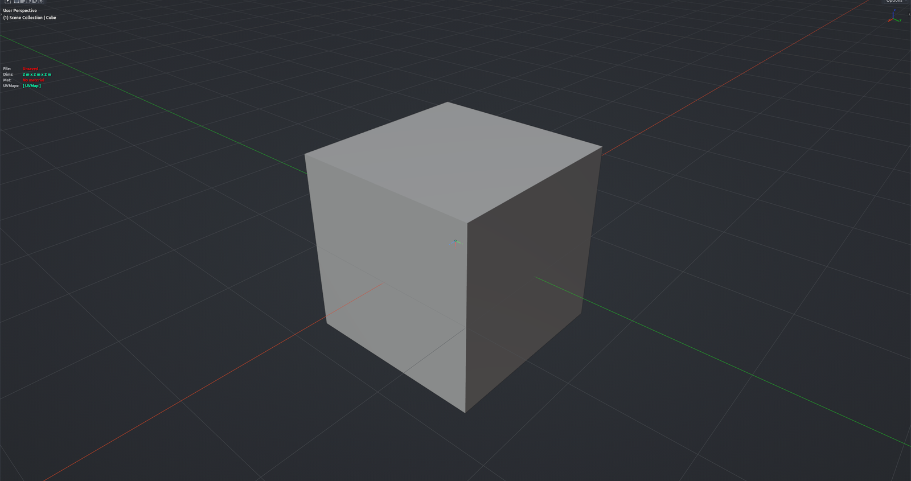

# Drop It!

Drops the selected mesh objects onto whatever surface lies beneath them, like letting props settle onto a floor or terrain. Each object is cast downward, moved to the hit point and optionally tilted to match the surface. Works on the whole selection in one go. Object Mode.

**Hotkey:** Not bound by default — assign a key in *Preferences › iOps › Keymaps*, or run it from the iOps pie / operator search. Also available: iOps Pie (<kbd>Ctrl</kbd>+<kbd>Alt</kbd>+<kbd>Shift</kbd>+<kbd>Q</kbd>) › Drop It!, and as a custom slot in the Edit pie.

## Options

- **Use Local Z** — drop along the object's own down axis; turn off to type a custom world direction.
- **Respect Lowest Face** — rest the object on its lowest face instead of its origin, so it does not sink into the ground.
- **Align to Surface** — rotate the object to match the surface it lands on.
- **Alignment Method** — Normal Only (simple), Track To (choose which axis faces the surface), or Project (keeps the object's heading).
- **Offset** — extra move applied after the drop, e.g. lift slightly off the ground.
- **Max Distance** — how far to search for a surface.

## Tips

- If a straight drop misses, the tool retries from higher up and from slightly offset positions before giving up.
- Non-mesh objects in the selection are skipped.
