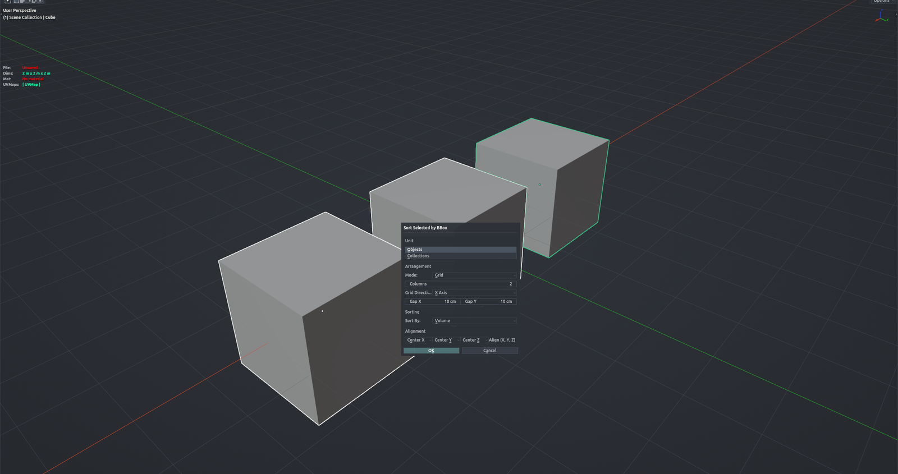

# KitBash Grid

Sorts the selected objects by size or name and lays them out in a neat row or grid, starting from the active object. Bounding boxes never overlap, so a pile of kitbash parts or props becomes an evenly spaced, easy-to-browse layout without measuring anything. Object Mode.

**Hotkey:** Not bound by default — assign a key in *Preferences › iOps › Keymaps*, or run it from the iOps pie / operator search. Also available: iOps Pie › **Grid** and **to Center**.

## Options
- **Operate On** — arrange individual objects, or treat each object's collection as one unit.
- **Mode** — *Linear* (one line), *Grid* (wrapped rows), or *To Center* (collapse everything to the world origin).
- **As Group** — in To Center mode, move the whole selection as one block instead of centering every object separately.
- **Columns** — how many columns in Grid mode (a square-ish count is suggested automatically).
- **Primary Axis / Gap X / Gap Y** — direction of the row and the spacing between bounding boxes.
- **Sort By / Align X, Y, Z** — order by volume, dimensions or name (normal or reversed), and which side of each bounding box lines up (min, center, max).

## Tips
- The active object sets the starting point and the height reference; make the anchor active last.
- Selecting only empties arranges them by the combined size of their mesh children.
