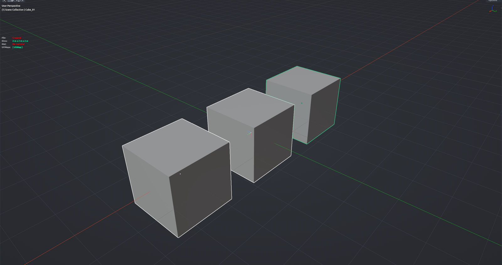

# Name from Active

Renames the selected objects after the active object using a simple pattern with a counter, so a set of fence segments, lamp posts or modular pieces gets clean, sequential names. By default the numbering follows distance from the active object. With a single object selected it instead copies the name to the clipboard and can sync the mesh data name. Object Mode.

**Hotkey:** Not bound by default — assign a key in *Preferences › iOps › Keymaps*, or run it from the iOps pie / operator search. Also available: the *IOPS TPS* sidebar panel (text icon).

## Options
- **New Name** — the base name; filled in from the active object.
- **Pattern** — how the name is built: `[N]` name, `[C]` counter, `[T]` object type, `[COL]` collection name. Default `[N]_[C]`.
- **Use Distance** — number objects by their distance from the active object instead of selection order.
- **Counter Digits / Shift Counter** — zero padding width, and start counting at 1 instead of 0.
- **Rename Active / Rename Linked / Rename Mesh Data** — include the active object, include its children, and rename the mesh data to match.
- **Trim** — strip a number of characters from the start or end of the active name before using it.

## Tips
- Select the targets first, then Shift-click the anchor so it becomes active.
- An empty pattern renames nothing.
