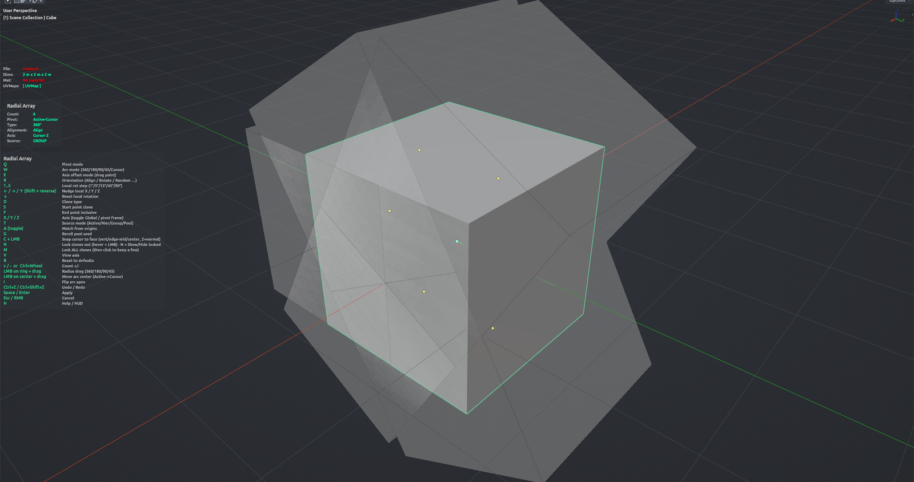

# Radial Array

Arranges copies of the selected objects around a pivot with a live preview in the viewport. Choose a full circle or an arc, drag the radius, lock out individual slots you don't want, and pick between duplicates, instances or moving the originals into place. Use it instead of the Array modifier when you need a real rotational layout with per-copy control, or when the axis comes from the 3D cursor or the active object. Object Mode; the active object marks the first slot.

**Hotkey:** Not bound by default — assign a key in *Preferences › iOps › Keymaps*, or run it from the iOps pie / operator search. Also available: iOps Pie › **Radial Array**, and as a slot in the iOps Edit pie.

## Controls
| Key | Action |
| --- | --- |
| <kbd>Space</kbd> / <kbd>Enter</kbd> | Apply |
| <kbd>Esc</kbd> / <kbd>RMB</kbd> | Cancel |
| <kbd>H</kbd> | Show / hide the help legend |
| <kbd>Q</kbd> | Cycle pivot: Active-Cursor / Cursor / Active |
| <kbd>W</kbd> | Cycle arc: 360 / 180 / 90 / 45 / Active to Cursor |
| <kbd>E</kbd> | Axis-offset mode — then drag to slide the array along the axis |
| <kbd>R</kbd> | Cycle alignment: Align / Rotate / Random All / Random X / Y / Z |
| <kbd>D</kbd> | Cycle clone type: Duplicate / Instance / Replace |
| <kbd>T</kbd> | Cycle source: Active / Hierarchy / Group / Pool |
| <kbd>A</kbd> | Match — snap the original objects onto the nearest slots (press again to restore) |
| <kbd>G</kbd> | Re-roll the random pool |
| <kbd>S</kbd> | Toggle a clone on the start point |
| <kbd>F</kbd> | Toggle a clone on the end point (arcs only) |
| <kbd>X</kbd> / <kbd>Y</kbd> / <kbd>Z</kbd> | Choose the axis; press again to switch between pivot-local and global |
| <kbd>V</kbd> | Use the view axis |
| <kbd>C</kbd> | Face pick — hover a face and click to snap the 3D cursor to it |
| <kbd>N</kbd> | Show / hide locked clones |
| <kbd>M</kbd> | Lock all slots (or unlock all) |
| <kbd>I</kbd> | Flip the arc to the other side (Active to Cursor) |
| <kbd>B</kbd> | Reset all parameters |
| <kbd>1</kbd>–<kbd>5</kbd> | Rotation step: 1° / 5° / 15° / 45° / 90° |
| <kbd>←</kbd> / <kbd>→</kbd> / <kbd>↑</kbd> | Rotate each clone around its local X / Y / Z by the step (<kbd>Shift</kbd> reverses) |
| <kbd>↓</kbd> | Reset per-clone rotation |
| <kbd>+</kbd> / <kbd>-</kbd> | Count +1 / −1 |
| <kbd>Ctrl</kbd>+Wheel | Count ±1 (±10 with <kbd>Shift</kbd>) |
| <kbd>LMB</kbd> on a clone | Lock / unlock that slot |
| <kbd>LMB</kbd> drag on the ring | Change the radius, or bend the arc |
| <kbd>LMB</kbd> drag on the center | Move the arc center (Active to Cursor) |
| <kbd>Ctrl</kbd>+<kbd>Z</kbd> / <kbd>Ctrl</kbd>+<kbd>Shift</kbd>+<kbd>Z</kbd> | Undo / redo a parameter change inside the tool |
| <kbd>MMB</kbd> / Wheel | Navigate the viewport as usual |

## Tips
- The result goes into a new collection named after the source object.
- Locked slots are skipped when you apply — handy for leaving a gap in the circle.
- In Replace mode the original objects are moved into the slots; extra slots become instances.
