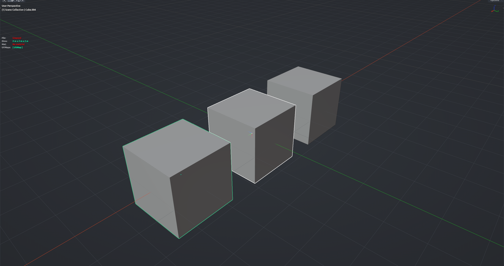

# Object Replace

Swaps the selected objects for copies of the active object. Each copy lands exactly where its target was, keeping the target's rotation and scale unless you say otherwise. Use it to replace placeholders with the final asset, or to scatter one object over a set of pre-placed dummies. Object Mode.

**Hotkey:** Not bound by default — assign a key in *Preferences › iOps › Keymaps*, or run it from the iOps pie / operator search. Also available: iOps Pie › **Object Replace**, and as a slot in the iOps Edit pie.

## Options
- **Mode** — *Replace* deletes the targets; *Add* keeps them and just places copies on top.
- **Keep Rotation / Keep Scale** — use the source's rotation or scale instead of the target's.
- **Keep Target Collection / Keep Source Collection** — where the new copies are linked; otherwise they go into an "Object Replace" collection.
- **Use Groups** — treat the source as a whole hierarchy (parent Empty plus children) and duplicate the entire group at each target.
- **Linked Data** — make instances that share mesh data instead of full copies.
- **Select Replaced** — select the new copies when done.

## Tips
- Select the targets first, then Shift-click the source so it is active.
- You can tweak options in the redo panel afterwards; the copies stay at the original target positions.
