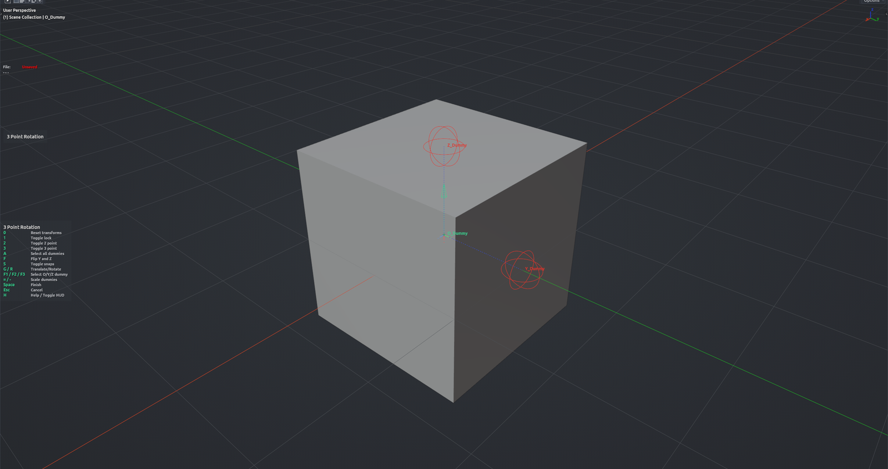

# Three Point Rotation

Orient an object by placing three helper points: an origin and two aim targets that define the new Y and Z directions. Move the helpers (with snapping if you like) until they sit where you want, link the object to them and confirm. The helpers are removed and the object keeps the new transform. Object Mode, single active mesh.

**Hotkey:** Not bound by default — assign a key in *Preferences › iOps › Keymaps*, or run it from the iOps pie / operator search.

## Controls

| Key | Action |
| --- | --- |
| <kbd>F1</kbd> / <kbd>F2</kbd> / <kbd>F3</kbd> | Select the origin / Y / Z helper and start moving it |
| <kbd>A</kbd> | Select all three helpers |
| <kbd>G</kbd> / <kbd>R</kbd> | Move / rotate the selected helpers |
| <kbd>S</kbd> | Toggle snapping |
| <kbd>F</kbd> | Swap the Y and Z helpers |
| <kbd>1</kbd> | Link the object to the helper rig (toggle) |
| <kbd>2</kbd> | Aim with the Z helper only (toggle) |
| <kbd>3</kbd> | Aim with both Y and Z helpers (toggle) |
| <kbd>0</kbd> | Reset the object to where it started |
| <kbd>=</kbd> / <kbd>-</kbd> | Make helpers bigger / smaller |
| <kbd>H</kbd> | Show / hide the help legend |
| <kbd>Space</kbd> | Confirm |
| <kbd>Esc</kbd> | Cancel |

## Tips

- Typical flow: place the helpers, press <kbd>3</kbd> to aim, press <kbd>1</kbd> to link the object, then <kbd>Space</kbd>.
- Your snapping settings are restored when the tool ends.
