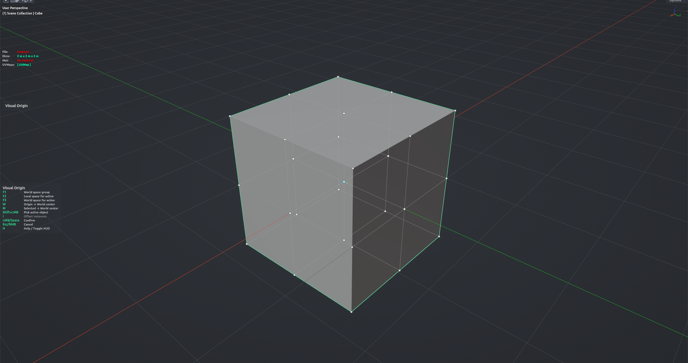

# Visual Origin

Sets the origin of the selected objects by picking a point on a bounding cage. Run it, and a box with corners, edge midpoints, face centers and a body center appears around the active object; the point nearest your mouse lights up, and a click drops the origin there for the whole selection. No need to place the 3D cursor first — the cursor is put back where it was when you finish. Object Mode, needs an active mesh.

**Hotkey:** Not bound by default — assign a key in *Preferences › iOps › Keymaps*, or run it from the iOps pie / operator search.

## Controls
| Key | Action |
| --- | --- |
| Move mouse | Highlight the nearest cage point |
| <kbd>LMB</kbd> / <kbd>Space</kbd> | Confirm — set origin to the highlighted point |
| <kbd>Esc</kbd> / <kbd>RMB</kbd> | Cancel |
| <kbd>F1</kbd> | Cage around the whole selection |
| <kbd>F2</kbd> | Cage in the active object's local space |
| <kbd>F3</kbd> | Cage in world axes around the active object |
| <kbd>Shift</kbd>+<kbd>LMB</kbd> | Click another selected object to make it the cage object |
| <kbd>W</kbd> | Put the origins of all selected objects at the world center and finish |
| <kbd>M</kbd> | Move all selected objects to the world center and finish |
| <kbd>I</kbd> | Toggle Offset Instances (keep linked duplicates from jumping) |
| <kbd>H</kbd> | Show / hide the help legend |
| <kbd>MMB</kbd> / Wheel | Navigate the viewport as usual |

## Options
- **Hold Cursor** — restore the 3D cursor to where it was after confirming (on by default).
- **Offset Instances** — when objects share mesh data, shift the linked copies back so they stay in place.

## Tips
- The whole-selection and world cages (F1 / F3) are rebuilt from a temporary join of the meshes — heavy selections take a moment.
