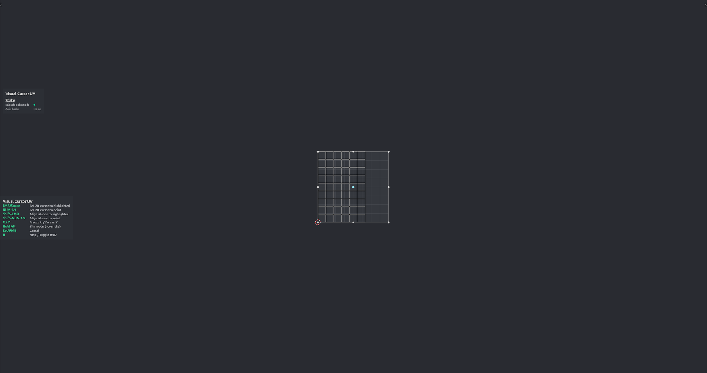

# UV Visual Cursor

Place the UV Editor's 2D cursor on a snap point of the selection's bounding box — the UV counterpart of Visual Origin. A nine-point cage (corners, edge midpoints, centre) is drawn around the selected UVs; hover to highlight a point and click to set the cursor there. Hold <kbd>Alt</kbd> to snap to the UDIM tile under the mouse instead. Edit Mode, UV Editor.

**Hotkey:** Not bound by default — assign a key in *Preferences › iOps › Keymaps*, or run it from operator search.

## Controls
| Key | Action |
| --- | --- |
| Mouse move | Highlight the nearest cage point |
| <kbd>LMB</kbd> / <kbd>Space</kbd> | Set the 2D cursor to the highlighted point |
| Numpad <kbd>1</kbd>–<kbd>9</kbd> | Set the 2D cursor to that cage point directly |
| <kbd>Shift</kbd>+<kbd>LMB</kbd> | Align the selected islands to the highlighted point |
| <kbd>Shift</kbd>+Numpad <kbd>1</kbd>–<kbd>9</kbd> | Align the selected islands to that cage point |
| <kbd>X</kbd> / <kbd>Y</kbd> | Freeze U / freeze V while aligning |
| <kbd>Alt</kbd> (hold) | Tile mode: cage follows the UDIM tile under the mouse |
| <kbd>MMB</kbd> / Wheel | Pan / zoom |
| <kbd>Esc</kbd> / <kbd>RMB</kbd> | Cancel |
| <kbd>H</kbd> | Show / hide the help legend |

## Tips
- With nothing selected the tool starts in tile mode.
- Setting the cursor only moves the cursor; use [Drag Snap UV](op_drag_snap_uv.md) to move the UVs themselves.
