# Panels

InteractionOps has two kinds of panels: **popup panels** that appear under the mouse on a hotkey and vanish when you move away, and **sidebar panels** docked in *3D View › N-panel › iOps* tab. The sidebar tab name can be changed in *Preferences › iOps › General*.

---

## TPS (Transform / Pivot / Snap)

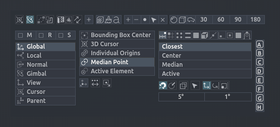

Everything about how transforms behave, in one popup: gizmos, orientation, pivot point, snapping and the eight Snap Combo slots. In the UV Editor it shows UV select modes, pivot and UV snapping instead.

**Hotkey:** <kbd>Shift</kbd>+<kbd>Mouse Button 4</kbd> (3D View and UV Editor)

| Button | What it does |
| --- | --- |
| Lock cursor, Rotate around active, Auto Merge, Auto Merge & Split, Correct Face Attributes, Keep Connected, Live Unwrap | Common tool-setting toggles |
| Create orientation | New custom transform orientation from the selection |
| Homogenize UV names | Rename UV maps on the selection to ch1, ch2, ... |
| UV cleanup | Remove all UV maps from the selection |
| Name from Active | Rename the selection after the active object |
| **M / R / S** | Show the move / rotate / scale gizmo |
| Orientation, rename, delete | Manage transform orientations |
| Pivot Point, Edit Origin, Only Locations, Skip Children | Pivot settings |
| Snap to, Target, Self, Align Rotation, Backface Culling, Selectable, Move / Rotate / Scale, angle increment | Snap settings |
| **A – H** | [Snap Combo](../operators/op_snap_combos.md) slots: click to recall, Shift+click to save |
| Smooth / Flat / Auto Smooth 30°–180° | Shading shortcuts (with MACHIN3tools installed) |
| Reload Images, display channels, Repeat | UV Editor header row |

---

## Transform

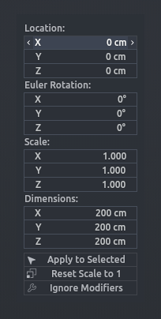

A compact popup with the active object's location, rotation, scale and dimensions, so you can type exact values without opening the N-panel.

**Hotkey:** <kbd>Ctrl</kbd>+<kbd>Alt</kbd>+<kbd>Shift</kbd>+<kbd>T</kbd> (Object Mode)

| Button | What it does |
| --- | --- |
| Location / Rotation / Scale | Edit the active object's transform |
| Dimensions | Resize the object by its real size |
| **Apply to Selected** | Push the typed dimensions to every selected object |
| **Reset Scale to 1** | Bake the new size into the mesh and reset scale |
| **Ignore Modifiers** | Measure the base mesh, not the modified result |

---

## Data

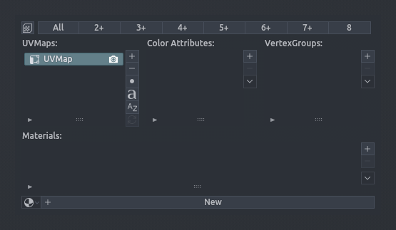

The active mesh's UV maps, colour attributes, vertex groups and material slots side by side, with add / remove / assign buttons — a popup version of the Object Data tab.

**Hotkey:** <kbd>Ctrl</kbd>+<kbd>Shift</kbd>+<kbd>Mouse Button 4</kbd> (3D View and UV Editor, mesh active)

| Button | What it does |
| --- | --- |
| Homogenize UV names | Rename UV maps to ch1, ch2, ... on the selection |
| **All, 2+, 3+ ... 8** | Keep only the first N UV maps on the selection (All removes every one) |
| UVMaps list: +, -, set active by object, set active by name, sort, channel hop | Manage UV maps across the selection |
| Color Attributes list: +, -, menu | Manage colour attributes |
| Vertex Groups list: +, -, menu, up / down, Assign / Remove / Select / Deselect, Weight | Manage vertex groups |
| Materials list: +, -, menu, up / down, material picker, Assign / Select / Deselect | Manage material slots |

---

## Modifiers

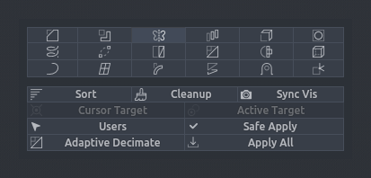

A modifier stack you can drive with modifier keys. The icon grid adds or manages a modifier type on the whole selection; the tool row cleans and sorts stacks; the list below edits the active object's stack row by row. Also docked in the sidebar.

**Hotkey:** <kbd>Alt</kbd>+<kbd>Shift</kbd>+<kbd>RMB</kbd>

| Button | What it does |
| --- | --- |
| Icon grid (click) | Add that modifier type to the selection with your preset defaults |
| Icon grid, <kbd>Ctrl</kbd> | Apply all modifiers of that type |
| Icon grid, <kbd>Alt</kbd> | Remove all modifiers of that type |
| Icon grid, <kbd>Shift</kbd> | Toggle viewport visibility of that type |
| Icon grid, last **+** button | Blender's own Add Modifier menu, for types not in the grid |
| **Sort** | Order stacks by the Sort Order set in preferences: rules of modifier type + optional comma-separated names (default: Geometry Nodes "Smooth by Angle" / Mirror / Array on top, Simple Deform / Weighted Normal / Triangulate at the bottom; everything else keeps its order) |
| **Cleanup** | Remove modifiers that do nothing (empty targets, zero values) |
| **Sync Vis** | Make render visibility match viewport visibility |
| **Cursor Target** | Create an empty at the 3D cursor and use it as the modifier target |
| **Active Target** | Use the active object as the modifier target on the others |
| **Users** | Select objects whose modifiers reference the active object |
| **Safe Apply** | Apply transforms without breaking distance-based modifier settings |
| **Adaptive Decimate** | Add a curvature-aware Geometry Nodes decimate |
| **Apply All** | Bake the whole stack into the mesh |
| Stack row: expand, name, eye, up, down, apply, copy to selected, remove, save preset | Per-modifier actions. <kbd>Alt</kbd> runs the action on every selected object with the same modifier; <kbd>Shift</kbd> picks the variant (to top / bottom, render visibility, apply up to here) |

---

## Collection Append

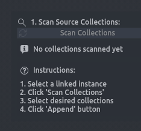

Turn a linked collection instance into local, editable collections: scan the source file, tick the collections you want, append. Sidebar panel (Object Mode).

**Hotkey:** None — sidebar panel.

| Button | What it does |
| --- | --- |
| **Scan Collections** | List the collections inside the selected linked instance |
| Collection list with checkboxes, **Select All / Deselect All** | Choose what to bring in |
| **Append (N selected)** | Append the chosen collections into the scene |

---

## Vertex Color

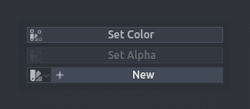

Quick vertex colouring: pick a colour or palette swatch and stamp it onto the selection. Sidebar panel.

**Hotkey:** None — sidebar panel.

| Button | What it does |
| --- | --- |
| Colour picker, palette | Choose the colour |
| **Set Color** | Assign the colour to the selected vertices / faces |
| **Set Alpha** | Assign the alpha value only |

---

## Object Color

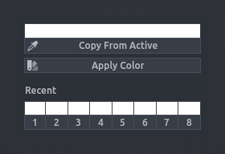

Set the viewport object colour of the selection and keep a row of recent colours. Sidebar panel.

**Hotkey:** None — sidebar panel.

| Button | What it does |
| --- | --- |
| Colour picker | Choose the colour |
| **Copy From Active** | Load the active object's colour into the picker |
| **Apply Color** | Apply the picker colour to all selected objects |
| **Recent** swatches | Click a numbered swatch to apply that colour again |

---

## Selection Sets

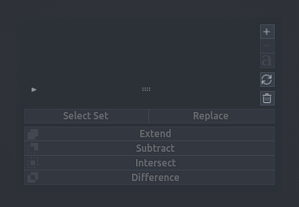

Named vertex / edge / face selections stored on the mesh. Save, recall, replace and combine them; the same controls are also in the 3D View header as a popover. Sidebar panel (Edit Mesh).

**Hotkey:** None — sidebar panel and header popover.

| Button | What it does |
| --- | --- |
| Set list | Pick the active set; shows element type and a stale warning |
| **+ / - / rename / refresh / trash** | Create, delete, rename, refresh all, delete all |
| **Select Set** | Select the stored elements |
| **Replace** | Overwrite the set with the current selection |
| **Extend / Subtract / Intersect / Difference** | Combine the current selection with the set (Shift: write the result into the set) |
| Preview (eye) | Highlight the set in the viewport without selecting |

---

## Material Override

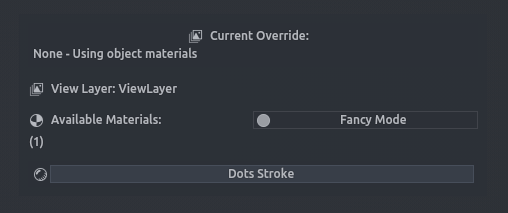

Set or clear the view layer's material override from a list of scene materials — a clay / checker / lighting pass without touching the objects.

**Hotkey:** Not bound by default — assign a key to *View Layer Material Override* in *Preferences › iOps › Keymaps*.

| Button | What it does |
| --- | --- |
| **Current Override** + **Clear** | Show and remove the active override |
| **Fancy Mode** | Show material previews instead of plain names |
| Material buttons | Set that material as the override (checkmark = active) |
| Refresh / Generate All Previews | Rebuild the preview thumbnails |

---

## Library

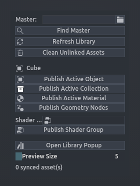

Home of the iOps master asset library: point it at a master file, publish things into it, refresh, and open the popup palette. Sidebar panel.

**Hotkey:** None — sidebar panel (the popup itself is <kbd>Ctrl</kbd>+<kbd>Alt</kbd>+<kbd>Q</kbd>).

| Button | What it does |
| --- | --- |
| **Master**, **Find Master** | Choose or locate the master library file |
| **Refresh Library** | Re-sync the catalog |
| **Clean Unlinked Assets** | Remove assets whose source is gone |
| **Publish Active Object / Collection / Material / Geometry Nodes / Shader Group** | Add to the library |
| **Open Library Popup** | Open the [Library Popup](ui_pies.md#library-popup) |
| Preview size | Thumbnail size in the popup |
| Status, Queue | Background sync progress |

---

## Executor

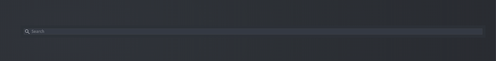

A popup list of your own Python scripts from the Executor folder — click a name to run it. Type in the search box to filter.

**Hotkey:** <kbd>Ctrl</kbd>+<kbd>Alt</kbd>+<kbd>Shift</kbd>+<kbd>X</kbd>

| Button | What it does |
| --- | --- |
| Search field | Fuzzy-filter the script list |
| Script name | Run that script |

The folder, column count and name length are set in *Preferences › iOps › Script Executor*.

---

## Widgets

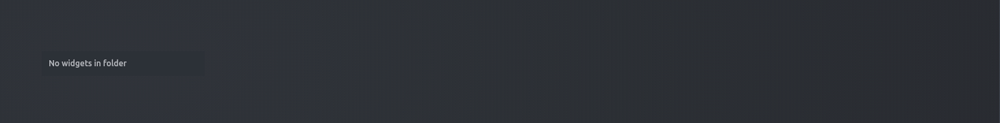

A popup list of the GPU widgets defined in your widgets folder (JSON). Click a widget to show or hide its on-screen panel; opening the list also reloads edited widget files.

**Hotkey:** Not bound by default — assign a key to *IOPS Widgets Panel* in *Preferences › iOps › Keymaps*.

| Button | What it does |
| --- | --- |
| Widget name | Toggle that widget in the viewport |

Widgets are composed in *Preferences › iOps › Widgets*.

---

## UV Tools

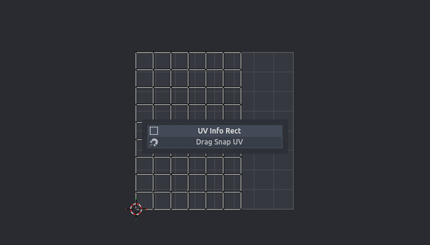

A small sidebar panel in the UV Editor (*N-panel › iOps*) with the two UV helpers.

| Button | What it does |
| --- | --- |
| UV Info Rect | Drag a rectangle in the UV editor to read its min / max / size; the values are copied to the clipboard |
| Drag Snap UV | [Drag Snap UV](../operators/op_drag_snap_uv.md): drag a UV vertex onto another one |
