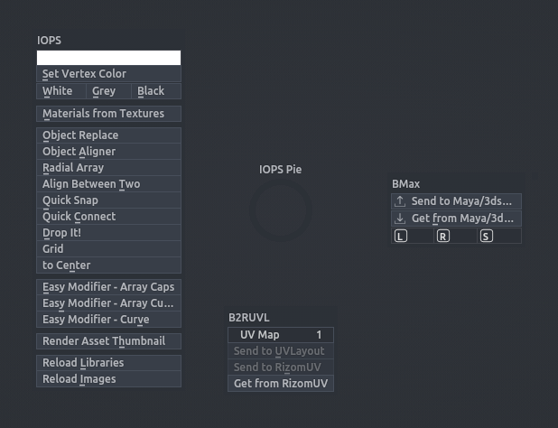
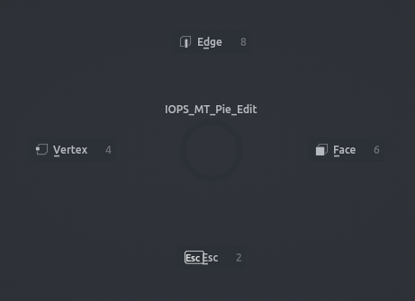
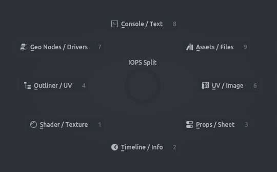
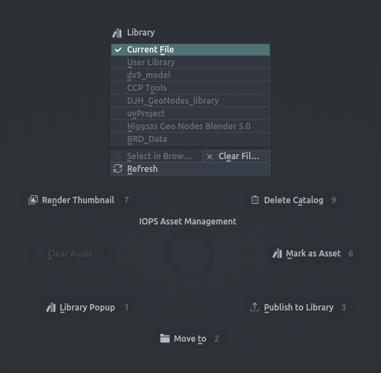
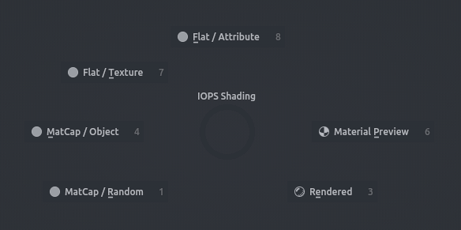

# Pie Menus

InteractionOps adds five pie menus and one floating library palette. Every pie has its own hotkey (see *Preferences › iOps › Keymaps*); buttons that cannot run in the current context are hidden, so a pie only shows what works right now.

---

## Main Pie

The everyday toolbox: vertex colours, object tools, mesh tools and the Easy Modifier helpers, plus bridges to companion addons when they are installed.

**Hotkey:** <kbd>Ctrl</kbd>+<kbd>Alt</kbd>+<kbd>Shift</kbd>+<kbd>Q</kbd>

| Slot | Button | What it does |
| --- | --- | --- |
| Left (iOps box) | Colour picker + **Set Vertex Color**, **White / Grey / Black**, **Set Vertex Alpha** | Paint the selection with a vertex colour or alpha |
| | **Materials from Textures** | Build materials from the textures in the file |
| | **Object Replace** | Swap selected objects for the active one |
| | **Object Aligner** | Match objects to a reference by shape |
| | **Radial Array** | Circular array around the cursor |
| | **Align Between Two** | Place the active object between two others |
| | **Quick Snap** | Snap mesh elements point to point |
| | **Quick Connect** | Connect selected vertices across faces |
| | **Tris to Quads** | Triangulate and re-quad the selection |
| | **Smart Inset**, **Straight Bevel**, **Shear**, **Hinge**, **Converge**, **Vert Fuse** | Edit Mesh tools (hidden outside Edit Mode) |
| | **Drop It!** | Drop objects onto the surface below |
| | **Grid** / **to Center** | Arrange kitbash pieces on a grid or gather them at the centre |
| | **Easy Modifier - Array Caps / Array Curve / Curve / SHWARP** | Modifier setup shortcuts |
| | **Render Asset Thumbnail** | Render a preview for the active asset |
| | **Reload Libraries**, **Reload Images** | Refresh linked files and textures |
| Right | **BMax** / **BMoI** boxes | Send to / get from 3ds Max, Maya or MoI3D — only when those connector addons are installed |
| Bottom | **B2RUVL** box | UV map choice and send/get for UVLayout and RizomUV (needs the B2RUVL addon) |
| Top (Edit Mesh only) | **Non-Planar Overlay** | Toggle the non-planar face overlay |
| | **ForgottenTools** box | Connect Spread, Grid Fill, Dice Faces, Hinge, Separate Duplicate, Selection Sets — when Forgotten Tools is installed |
| Top-right (Edit Mesh only) | **Optiloops** | When the Optiloops addon is installed |

---

## Edit Pie

A context pie that mirrors the F1–F5 dispatcher: the four cardinal buttons are the current F1 / F2 / F3 / Esc actions for the active object type and mode, with a box of the object's most-used settings next to them in Object Mode.

**Hotkey:** Not bound by default — assign a key to *IOPS Pie Edit* in *Preferences › iOps › Keymaps*.

| Object | Mode | F1 | F2 | F3 | Esc |
| --- | --- | --- | --- | --- | --- |
| Mesh | any | Vertex | Edge | Face | Esc |
| Armature | Object | Edit Mode | Pose Mode | Set Parent to Bone | Esc |
| Armature | Edit / Pose | Object Mode / Edit Mode | Pose / Object Mode | Set Parent to Bone | Object Mode |
| Empty | any | Open Instance Collection .blend | Realize Instances | — | Esc |
| Curve | Object | Edit Mode | Duplicate | Switch Direction | Toggle Cyclic |
| Curve | Edit | Object Mode | Subdivide | Spline Type | Esc |
| Curves (hair) | Object / Edit / Sculpt | Edit Mode / Object Mode | Duplicate / Subdivide | Cyclic / Sculpt Toggle | Esc |
| Camera | any | Active Camera | Camera View | Cam to View | Toggle DOF |
| Light | any | Duplicate | Toggle Shadow | Boost Power | Cycle Type |
| Text | Object / Edit | Edit Mode / Object Mode | Convert to Mesh / Duplicate | To Curve / Bold | Esc |
| Lattice | Object / Edit | Edit Mode / Object Mode | Duplicate | — / Flip U | Esc |
| Metaball | Object / Edit | Edit Mode / Object Mode | Duplicate | — / Threshold - | Finer Preview / Esc |
| Light Probe | any | Duplicate | + Influence | - Influence | Hide Viewport |

Extras:

| Context | Button | What it does |
| --- | --- | --- |
| Empty | **Size** box: 0.1 / 0.5 / 1 / 2 / 5 / 10, custom slider, **Copy from Active** | Set the display size of the selected empties |
| Empty | **Display** box: Plain Axes, Arrows, Single Arrow, Circle, Cube, Sphere, Cone, Image | Change the empty's display type; image empties get **Reload Image** and **Origin to Geometry** |
| Linked collection instance | **Make Instances Real**, **Expand Collection to Scene**, **Open <file>**, **Reload <file>** | Work with the instanced library |
| Mesh, Edit Mode | **Visual UV** | Show UVs on the mesh in the viewport |
| UV Editor | Vertex / Edge / Face / Esc + **Island Selection** | UV select modes and island toggle |
| No active object | **Open Asset in Current Blender** | When an asset is selected in the Asset Browser |

---

## Split Pie

Open or close a second editor next to the current one with a flick. Each of the eight slots is yours to configure in *Preferences › iOps › Split Pie Layout*: primary editor, alternate editor, side and split size.

**Hotkey:** <kbd>Ctrl</kbd>+<kbd>Alt</kbd>+<kbd>Shift</kbd>+<kbd>S</kbd>

| Slot | Default editor |
| --- | --- |
| Left | Outliner |
| Right | UV Editor |
| Bottom | Timeline |
| Top | Python Console |
| Top-left | File Browser |
| Top-right | Text Editor |
| Bottom-left | Shader Editor |
| Bottom-right | Properties |

| Click | What it does |
| --- | --- |
| Click | Open the slot's editor on its side; click again to close it |
| <kbd>Shift</kbd>+Click | Open the slot's alternate editor |
| <kbd>Alt</kbd>+Click | Switch the current area to that editor in place (no split) |
| <kbd>Ctrl</kbd>+Click | Turn the current area back into a 3D Viewport |

---

## Assets Pie

Asset Browser housekeeping without leaving the viewport: mark and clear assets, move them between catalogs, switch libraries and publish to the iOps Library.

**Hotkey:** <kbd>Ctrl</kbd>+<kbd>Alt</kbd>+<kbd>Shift</kbd>+<kbd>A</kbd>

| Slot | Button | What it does |
| --- | --- | --- |
| Left | **Clear Asset** | Un-mark the selected assets |
| Right | **Mark as Asset ›** Object / Collection / Active Material / Active Image | Mark the chosen datablock as an asset |
| Bottom | **Move to ›** | Catalog tree of the current library; **Search**, **New Catalog** |
| Top | **Library** box | Pick *Current File* or any asset library, **Select in Browser**, **Clear Filter**, **Refresh**, **Open Asset in Current Blender** |
| Top-left | **Render Thumbnail** | Render a preview image for the active asset |
| Top-right | **Delete Catalog ›** | Catalog tree with **Search** and **Delete Empty Catalogs** |
| Bottom-left | **Library Popup** | Open the iOps Library palette (below) |
| Bottom-right | **Publish to Library ›** Active Object / Active Collection / Active Material / Shader Group / Geometry Nodes | Publish to the iOps master library |

---

## Shading Pie

Up to eight viewport shading presets, one per slot: Solid with a lighting and colour mode, Material Preview or Rendered with a render pass, optional scene world. Configure names and contents in *Preferences › iOps › Shading Pie*; empty slots are left blank.

**Hotkey:** No default key — assign one to *IOPS Pie Shading* in *Preferences › iOps › Keymaps*.

| Slot | What it does |
| --- | --- |
| Any enabled slot | Apply that shading preset to the current 3D Viewport |

Slot labels are generated from the preset (for example *Studio / Random* or *Rendered / AO*) unless you give the slot a name.

---

## Library Popup

A floating palette drawn over the 3D View that shows the assets of your iOps master library as thumbnails, grouped by category. Click a tile to insert that asset at the 3D cursor. The viewport stays fully usable around the palette.

**Hotkey:** <kbd>Ctrl</kbd>+<kbd>Alt</kbd>+<kbd>Q</kbd> (3D View). Also available: Assets Pie › *Library Popup*, Library panel › *Open Library Popup*.

| Control | What it does |
| --- | --- |
| Asset tile | Insert the asset into the scene |
| Tile **x** | Remove that asset from the library |
| Category header (Geometry, Materials & Shaders, Lights & Worlds, Misc) | Collapse / expand the group |
| **Publish:** Obj / Col / Mat / Node | Publish the active object, collection, material or node group |
| **-** / **Size** / **+** | Shrink or enlarge the thumbnails |
| **Refresh** | Re-sync the library |
| **X** | Close the palette |
| Drag the title bar | Move the palette |
| Wheel | Scroll the asset list |
| <kbd>Esc</kbd> / <kbd>RMB</kbd> over the palette | Close |
